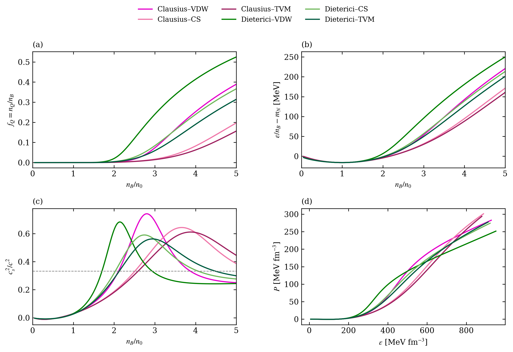
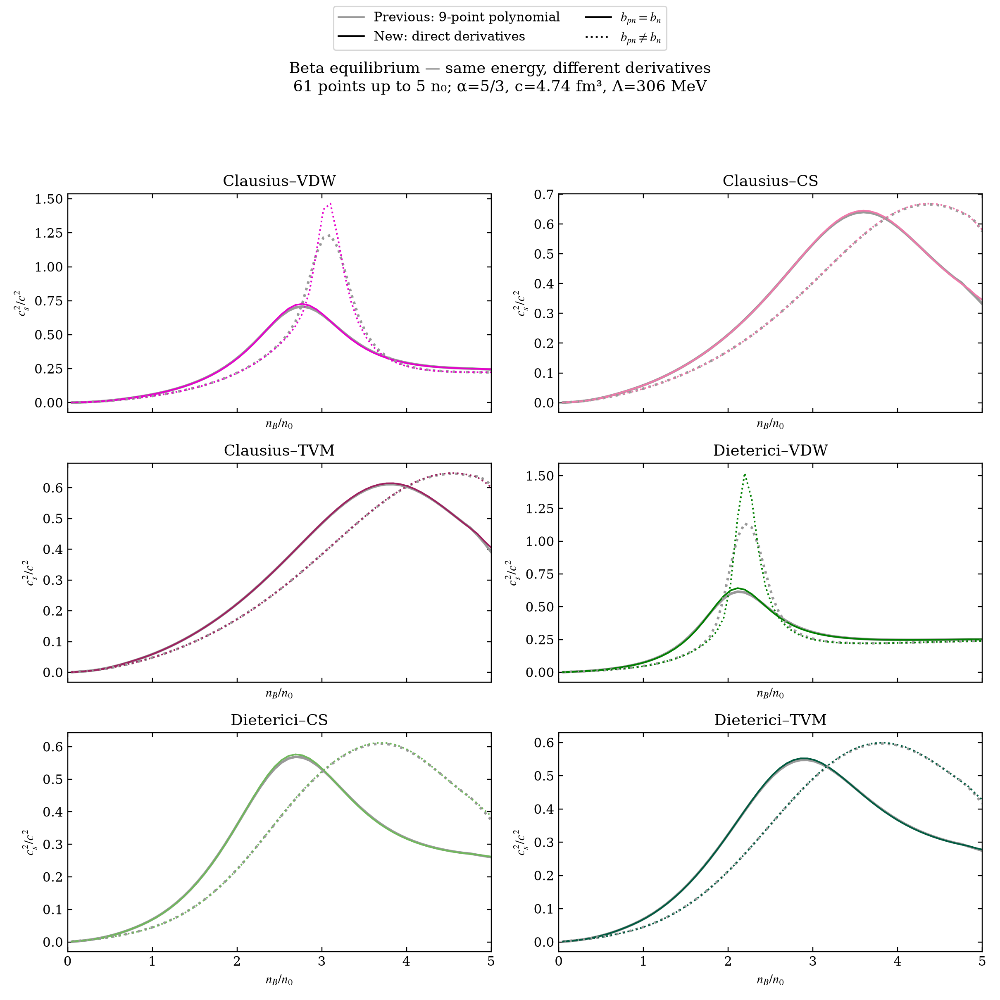

# QMM

QMM is a Python package for nuclear and quarkyonic matter calculations. It
computes ground-state parameters, liquid–gas critical points, equations of
state, sound speeds, and neutron-star mass–radius sequences. It includes symmetric and asymmetric matter, with optional beta equilibrium (leptons).

## Getting started

Requires Python 3.9 or newer. From the repository directory, on macOS, Linux,
or Windows with WSL:

```bash
python3 -m venv .venv
source .venv/bin/activate
python -m pip install -e '.[notebook]'
python -m qmm examples/cs_full.json
```

For interactive runs, launch `jupyter lab` and open the
[workflow notebook](notebooks/01_testing_separate_models/QMM_workflow.ipynb).
Follow the [three research stages](notebooks/README.md) from basic calculations
to model comparisons and the six-model beta-equilibrium study.
In VS Code, select the `.venv` notebook kernel; with WSL, open the repository
in a VS Code window connected to the same Linux distribution.

## Configuring a run

Copy an input from [examples/](examples/) or start with the
[blank template](examples/qmm_blank_template.json), then run:

```bash
python -m qmm path/to/your_config.json
```

The main settings are:

- `model`: model name and parameters, including an optional fit to a target `K0`.
- `workflows`: calculations to run, such as the critical point, quarkyonic EOS,
  asymmetric fit, or neutron stars.
- `asymmetric`: fixed proton fractions or beta equilibrium with electrons and muons.
- `output`: destination directory and whether to save CSV tables, JSON, and plots.

Baryquark matter is currently supported only for symmetric calculations.
New interaction models must be registered in [src/qmm/models.py](src/qmm/models.py)
before they can be selected in JSON.

## Selected results

**Symmetric matter.** Clausius and Dieterici with VDW, CS and TVM repulsion,
using α=5/3, c=4.74 fm³ and Λ=306 MeV. Generated by the final reference section of
[stage 2](notebooks/02_some_results/baryquark_quarkyonic.ipynb) from the
[saved symmetric calculations](Paper/symmetric_sound_speed_alpha_5over3_c_4p74/).
These historical curves retain their original polynomial derivatives.



**Beta-equilibrium sound speed.** Gray shows the previous polynomial method;
colored curves use direct derivatives of the same saved energies. Generated by
[the comparison script](scripts/compare_beta_direct_derivatives.py), also run in
[stage 3](notebooks/03_six_models_paper/fixed_parameters_symmetric_beta_eos_stars.ipynb).
The 61-point grid below 5 n₀ is a numerical comparison, not a convergence test.



## Notebooks and documentation

- [Workflow overview](notebooks/01_testing_separate_models/QMM_workflow.ipynb)
- [Notebook index](notebooks/README.md): individual models, comparisons, and six-model paper calculations
- [Manual](docs/QMM.pdf) ([LaTeX source](docs/qmm_complete_workflow_manual.tex))

Large parameter scans can take substantial time. The empirical asymmetric
notebook includes partial results; see its
[coverage and numerical diagnostics](Paper/empirical_asymmetric_lambda300/README.md)
before using the saved outputs.

Source code is in `src/qmm/`, input files in `examples/`, and saved calculations
and figures in `results/` and `Paper/`.

The bundled TOV integrator in `src/TOVsolver/` is derived from Anton Motornenko’s
[TOVsolver](https://github.com/amotornenko/TOVsolver) and retains its GPLv3+ notices.
